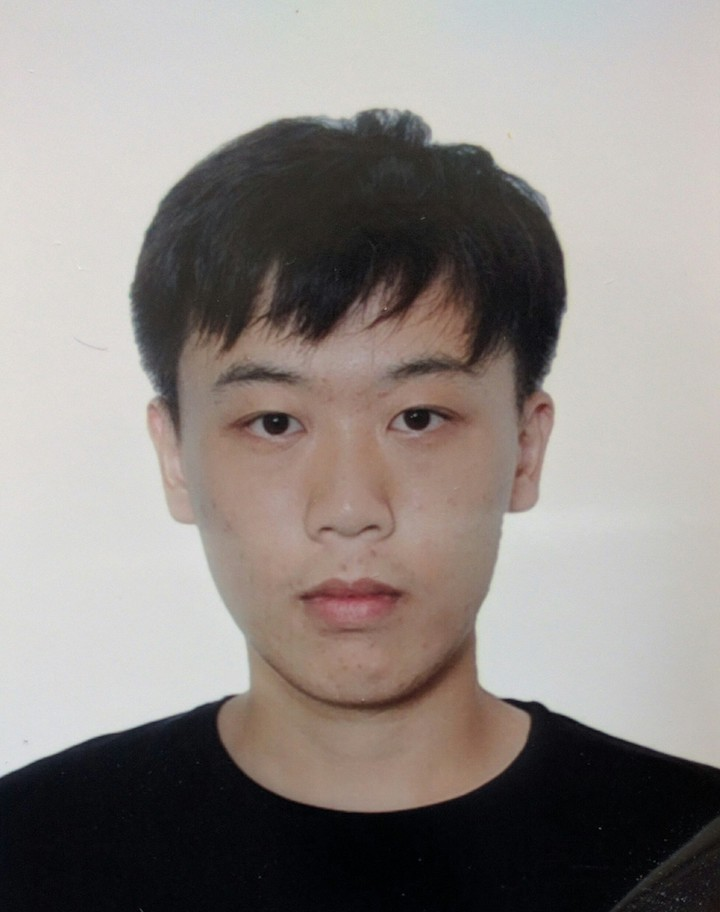

##Shengtao Wang

##Education

[Columbia University](https://www.columbia.edu/)

August 2019-May 2021, New York, NY

Master of Science in Earth and Environmental Engineering

[University of California, Davis](https://www.ucdavis.edu/)

September 2015-June 2019, Davis, CA

Bachelor of Science in Environmental Science and Management

Minor in Geographic Information Systems

[Waseda University](https://www.waseda.jp/top/en)

September 2016-August 2017, Tokyo, Japan

UC Education Abroad Program

##Research Interets

Sustainable Energy, Air Quality and Cliamte Change